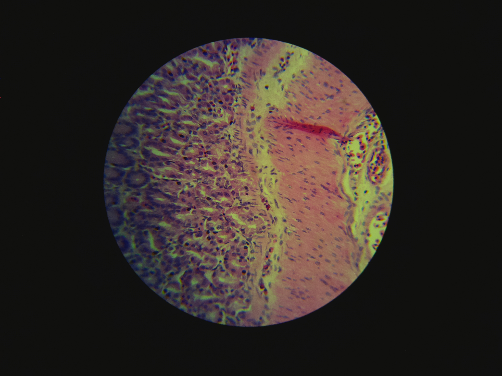

auto-scope
==========

[](https://travis-ci.org/python-friends/auto-scope)
[](https://codecov.io/gh/python-friends/auto-scope)
[](https://github.com/python-friends/auto-scope/graphs/contributors)

An open source whole slide scanner and automated cell discrimination and counting system. Check out the [blog](https://python-friends.github.io/)!



## Raspberry Pi setup 
There a few tricks to get autoscope running on a RPi. We are using [piwheels](https://www.piwheels.org/) to install a precompiled version of cv2. Unfortunately, this restricts us to using python 3.5 on the RPi. Running the precompiled version of RPi requires a few packages to work. Install the requirements with the apt-get commands below. Once they are installed you can run `pipenv install --dev --skip-lock` in project the folder to install all the Pipfile packages. 

```{bash}
sudo apt-get update 
sudo apt-get ugrade
sudo apt install python3-dev
sudo apt install libhdf-dev
sudo apt install libharfbuzz0b-dev
sudo apt install libwebp6-dev
sudo apt install libjasper-dev
sudo apt install libilmbase-dev
sudo apt install libopenexr-dev
sudo apt install libgstreamer1.0-dev
sudo apt install libavcodec-dev
sudo apt install libavformat-dev
sudo apt install libswscale-dev
```
